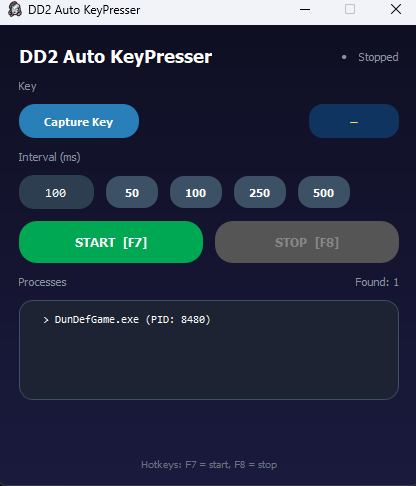

# DD2 Auto KeyPresser

Automatic key pressing tool for Dungeon Defenders 2. Sends key presses to the game window at specified intervals.



## Features

- Auto-detect game process (DunDefGame.exe)
- Customizable key binding
- Adjustable press interval (50-500+ ms)
- In-game overlay showing current status
- Global hotkeys for start/stop
- System tray support
- Works in background (no focus required)

## Installation

### From Release

1. Download `dd2-keypresser.exe` from [Releases](../../releases)
2. Place `config.ini` in the same folder (optional)
3. Run the exe

### From Source

```bash
# Clone repository
git clone https://github.com/yourusername/python-autokeypresser.git
cd python-autokeypresser

# Create virtual environment
python -m venv .venv
.venv\Scripts\activate

# Install dependencies
pip install -r requirements.txt

# Run
python dd2-keypresser.py
```

## Usage

1. Launch the application
2. Start Dungeon Defenders 2
3. Click **Capture Key** and press the key you want to auto-press
4. Set the interval (milliseconds between presses)
5. Press **START** or use the hotkey (default: F7)
6. Press **STOP** or use the hotkey (default: F8) to stop

### Hotkeys

| Action | Default Key |
|--------|-------------|
| Start  | F7          |
| Stop   | F8          |

Hotkeys work globally, even when the game is in focus.

## Configuration

Edit `config.ini` to customize settings:

```ini
[settings]
start_hotkey = F7
stop_hotkey = F8
game_name = DunDefGame.exe
```

### Available Hotkeys

`F1`-`F12`, `A`-`Z`, `0`-`9`, `space`, `enter`, `tab`, `esc`, `shift`, `ctrl`, `alt`

## Building

### Requirements

- Python 3.10+
- PyInstaller

### Build Commands

```bash
# Using Make
make build

# Or directly
pyinstaller dd2-keypresser.spec --clean --noconfirm
```

The exe file will be created in `dist/dd2-keypresser.exe`

## Project Structure

```
python-autokeypresser/
├── dd2-keypresser.py      # Main application
├── dd2-keypresser.spec    # PyInstaller spec file
├── config.ini             # Configuration file
├── app_icon.ico           # Application icon
├── requirements.txt       # Python dependencies
├── Makefile               # Build commands
└── README.md              # This file
```

## Dependencies

- PyQt5 - GUI framework
- psutil - Process monitoring
- pywin32 - Windows API access
- pystray - System tray support
- Pillow - Image processing

## How It Works

1. Monitors running processes for the game executable
2. When found, tracks the game window handle
3. Sends `WM_KEYDOWN`/`WM_KEYUP` messages to the game window
4. Uses `PostMessage` so it works even when the game is not focused
5. Overlay appears only when game window is in focus

## Troubleshooting

**App doesn't detect the game**
- Make sure the game process name matches `game_name` in config.ini
- Run the app as administrator if needed

**Keys not working in game**
- Some games block `PostMessage`. Try running as administrator
- Ensure you're not using a hotkey (F7/F8) as the press key

**Overlay not showing**
- Overlay only appears when game window is in focus
- Check if game is running in fullscreen borderless mode

## License

MIT License
